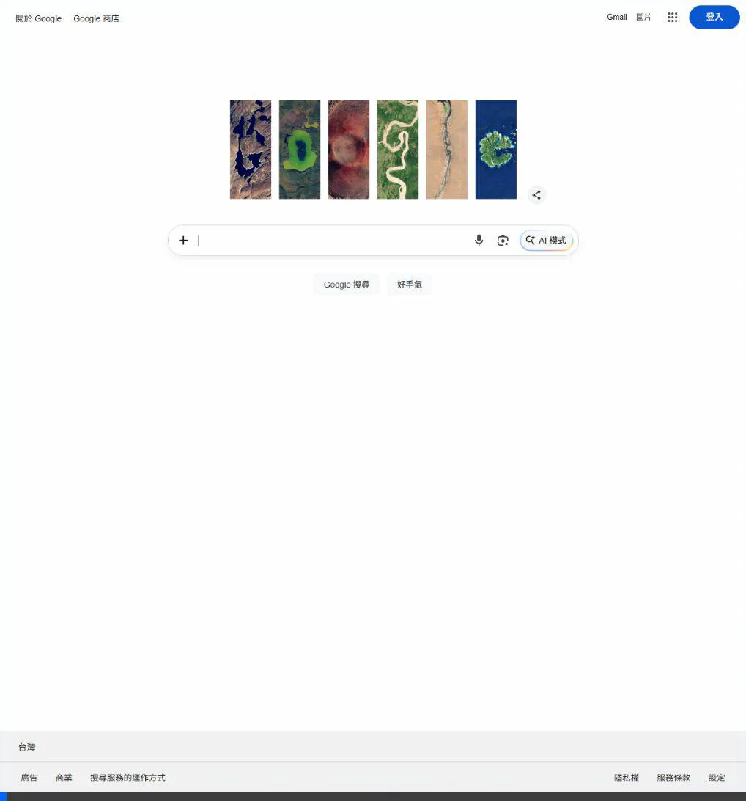

# 俄羅斯方塊遊戲 (Tetris)

這是一個使用純 HTML5、CSS3 與 Vanilla JavaScript 開發的現代風俄羅斯方塊遊戲。不依賴任何外部框架或圖片檔案，直接使用瀏覽器原生 API 即可執行。

## 遊玩展示

## 功能亮點

1. **純前端實現**：完全不需要安裝 Node.js、建置工具或任何外部函式庫，只要一個瀏覽器就能跑。
2. **現代化深色設計**：
    * 背景採用具有科幻感的徑向漸層 (`radial-gradient`)。
    * 遊戲面板使用了毛玻璃特效 (`backdrop-filter: blur`) 與柔和的陰影。
    * 每個方塊都有獨特的亮麗顏色，並且利用 Canvas 繪圖加上了亮部與暗部的邊緣，使其呈現「立體感」。
3. **合成音效 (Web Audio API)**：
    * 透過程式碼即時合成音頻（Oscillator），完美重現 8-bit 風格的懷舊音效。
    * 包含：移動、旋轉、直接下落(Hard drop)、消除整行、Game Over 音效。
4. **完整遊戲機制**：
    * **影子方塊 (Ghost Piece)**：精確預覽方塊的下落位置，輔助操作。
    * **Next Piece 預覽**：右側面板精準顯示下一個即將出現的方塊。
    * **Wall Kick（靠牆旋轉）**：靠近牆壁旋轉時會自動嘗試平移，防止卡死。
    * **計分與升級系統**：消除一行 100 分，一次消多行有額外加分。每消除 10 行提升一個等級（Level），等級越高方塊下落速度越快。
5. **繁體中文介面**：所有介面文字皆已轉換為清晰易懂的繁體中文。

## 如何開始遊玩

您可以點擊下方連結，在瀏覽器中開啟遊戲：
[🎮 開始遊戲：index.html](./index.html)

或者在您的本機電腦上，直接用瀏覽器開啟此專案目錄下的 `index.html`。

## 操作說明

* **開始遊戲**：點擊畫面中央的 `開始遊戲` 按鈕。 *(提示：由於瀏覽器安全策略，音效必須在使用者點擊畫面後才能啟用。)*
* **左箭頭 (←)**：向左移動
* **右箭頭 (→)**：向右移動
* **下箭頭 (↓)**：加速下落 (Soft drop)
* **上箭頭 (↑)**：順時針旋轉方塊
* **空白鍵 (Space)**：直接將方塊下落到底並固定 (Hard drop)
* **音效開關**：點擊右下角的喇叭按鈕可以開啟或關閉音效。
